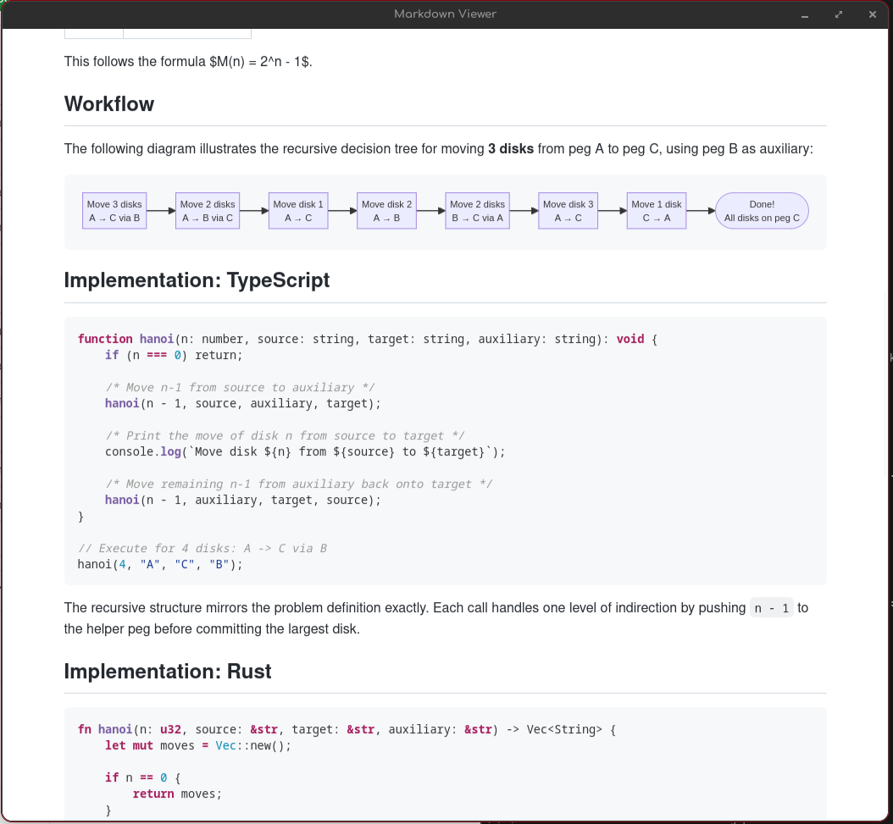

# markdownviewer



Minimal, fast Markdown viewer for Linux. Renders Markdown in a system webview with syntax-highlighted code blocks and Mermaid diagrams. No menus, no toolbar — just the document.

## Features

- **Instant rendering** — fast startup, chrome-free UI
- **Syntax highlighting** — code blocks highlighted via syntect (Rust, TypeScript, JavaScript, Go, Python, and more)
- **Mermaid diagrams** — flowcharts, sequence diagrams, Gantt charts rendered client-side
- **Live reload** — automatically refreshes when the source file changes
- **External links** — opens in your default browser
- **Window size persistence** — remembers your last window dimensions

## Installation

### Ubuntu / Debian

Download the `.deb` package from the [Releases](https://github.com/iskrid/markdownviewer/releases) page:

```bash
sudo dpkg -i markdownviewer_1.1.6_amd64.deb
```

**Runtime dependencies:** `libwebkit2gtk-4.1-0`, `libgtk-3-0` (usually pre-installed on desktop Ubuntu).

### CachyOS / Arch Linux

Build from the PKGBUILD:

```bash
mkdir -p packaging && cd packaging
curl -LO https://raw.githubusercontent.com/iskrid/markdownviewer/master/packaging/PKGBUILD
makepkg -si
```

Or use an AUR helper (once published to AUR):

```bash
yay -S markdownviewer
```

**Runtime dependencies:** `webkit2gtk-4.1`, `gtk3` (pulled in automatically).

### From Source

```bash
cargo install --git https://github.com/iskrid/markdownviewer
```

Requires `libwebkit2gtk-4.1-dev` and `libgtk-3-dev` at build time.

## Usage

```bash
# Open a Markdown file
markdownviewer README.md

# Pipe from stdin
cat notes.md | markdownviewer -

# Launch without arguments (shows placeholder)
markdownviewer
```

**Keyboard shortcuts:**
- `Esc`, `q`, `Ctrl+W`, `Ctrl+Q`, `Ctrl+C`, `Ctrl+D` — close window
- `←`, `→` — navigate to previous/next `.md` file in same directory

## Desktop Integration

The `.deb` and Arch packages install a `.desktop` entry and icons automatically.
Markdown files (`*.md`) will be associated with the viewer — right-click any
`.md` file in your file manager and choose "Open With Markdown Viewer".

The application appears in your desktop menu under **Utility**.

### Manual installation

If you installed from source or the binary tarball, install desktop assets:

```bash
sudo install -Dm644 packaging/markdownviewer.desktop /usr/share/applications/
for sz in 16 32 48 64 128 256 512; do
    sudo install -Dm644 "icons/app-icon-${sz}.png" "/usr/share/icons/hicolor/${sz}x${sz}/apps/markdownviewer.png"
done
sudo update-desktop-database
```

## Build

```bash
cargo build --release
./target/release/markdownviewer README.md
```

## License

MIT — see [LICENSE](LICENSE).
