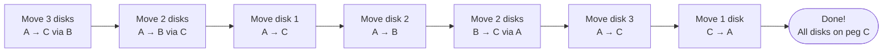
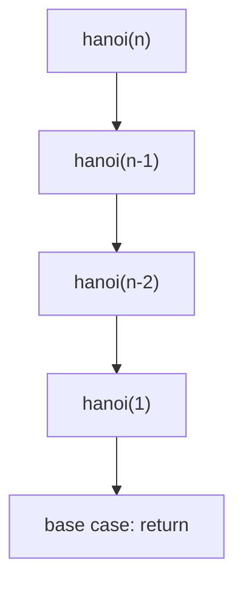

# The Tower of Hanoi

## Introduction

The **Tower of Hanoi** is a classic mathematical puzzle invented in 1883 by the French mathematician Édouard Lucas. Despite its simplicity, it elegantly demonstrates the power of *recursion* and has become a canonical example in computer science education.

Legend tells that an ancient temple in Kalinga, India, contains a large room with three granite pillars surrounded by sixty-four gold disks. Brahma placed these disks on one pillar at the time of creation, and a race of priest moves them according to Brahma's rules. When all disks are moved, the tower will crumble and the world will end.

> If the priests move one disk per second, completing 64 disks would require $2^{64} - 1$ seconds — **approximately 585 billion years**. For perspective, that is about forty times the current age of our universe.

## Rules

The puzzle consists of three rods and a number of disks of different sizes which can slide onto any rod. The puzzle begins with the disks in a neat stack in ascending order of size on one rod, the smallest at the top, thus approximating a conical shape.

The goal is to move the entire stack from the **source** rod to the **destination** rod, obeying the following simple rules:

1. Only **one disk** may be moved at a time.
2. Each move consists of taking the *upper* disk from one stack and placing it on another rod.
3. No disk may be placed **on top of a smaller disk**.

## How It Works

The recursive solution is straightforward:

To move _n_ disks from source to destination using an auxiliary rod:

- Move the top `n - 1` disks from **source** to **auxiliary**, using destination as temporary storage.
- Move the largest disk (the nth) directly from **source** to **destination**.
- Move the `n - 1` buffer disks from **auxiliary** to **destination**, using source as temporary storage.

### Minimal Moves

The minimum number of moves required for _n_ disks is always:

| Disks | Minimum Moves |
|------:|--------------:|
| 1     | 1             |
| 3     | 7             |
| 8     | 255           |
| 64    | ~1.84 × 10¹⁹   |

This follows the formula $M(n) = 2^n - 1$.

## Workflow

The following diagram illustrates the recursive decision tree for moving **3 disks** from peg A to peg C, using peg B as auxiliary:



## Implementation: TypeScript

```typescript
function hanoi(n: number, source: string, target: string, auxiliary: string): void {
    if (n === 0) return;

    /* Move n-1 from source to auxiliary */
    hanoi(n - 1, source, auxiliary, target);

    /* Print the move of disk n from source to target */
    console.log(`Move disk ${n} from ${source} to ${target}`);

    /* Move remaining n-1 from auxiliary back onto target */
    hanoi(n - 1, auxiliary, target, source);
}

// Execute for 4 disks: A -> C via B
hanoi(4, "A", "C", "B");
```

The recursive structure mirrors the problem definition exactly. Each call handles one level of indirection by pushing `n - 1` to the helper peg before committing the largest disk.

## Implementation: Rust

```rust
fn hanoi(n: u32, source: &str, target: &str, auxiliary: &str) -> Vec<String> {
    let mut moves = Vec::new();

    if n == 0 {
        return moves;
    }

    /* Move n-1 from source to auxiliary */
    moves.append(&mut hanoi(n - 1, source, auxiliary, target));

    /* Record the move of disk n */
    moves.push(format!("Move disk {} from {} to {}", n, source, target));

    /* Move remaining n-1 from auxiliary onto target */
    moves.append(&mut hanoi(n - 1, auxiliary, target, source));

    moves
}

fn main() {
    let solution = hanoi(4, "A", "C", "B");
    println!("{} total moves:", solution.len());
    for (i, move_desc) in solution.iter().enumerate(0) {
        println!("{:3}. {}", i + 1, move_desc);
    }
}
```

The Rust version collects all moves into a `Vec<String>` so they can be counted and printed at once. The recursion depth is intentionally unbounded to keep the implementation faithful — for very large _n_ an optimized iterative approach would avoid stack overflow.

## Complexity Analysis

- **Time complexity**: $O(2^n)$ — each problem instance spawns two subproblems of size `n - 1`.
- **Space complexity**: $O(n)$ on the call stack, since recursion goes exactly _n_ levels deep before hitting the base case and unwinding.

## Recursion Pattern

The call structure for any recursive solution follows this simple pattern:



## Key Takeaways

The Tower of Hanoi teaches several enduring lessons:

- Recursive problems have a *base case* (0 disks → do nothing) and a *reduction step* that makes strictly smaller sub-problems.
- The optimal sequence is **unique**. There are no shortcuts — the minimum move count cannot be improved upon by any other algorithm.
- For even just 15 disks, you need $2^{15} - 1 = 32,767 moves*
- Visualizing the *state space tree makes recursion much easier reason about complex problems.*

---

_Originally invented by Édouard Lucas in 1883._